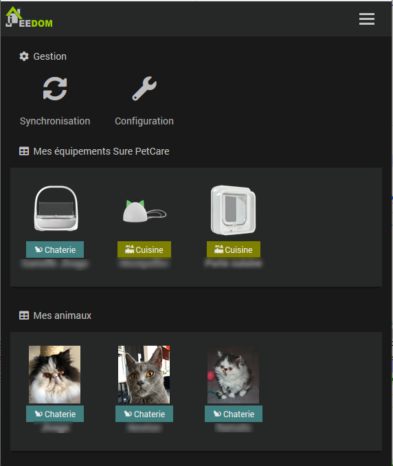
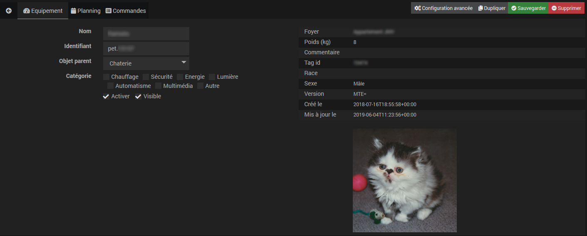

Description
===

Plugin permettant de contrôler les objets connectés pour animaux de la marque Sure Petcare (anciennement Sureflap).

Pour le moment les seuls objets connectés sont des chatières
- La grande chatière connect (Pet Porte Connect en anglais)
- La chatière à puce électronique connect (Microchip Cat Flap Connect en anglais)

Note : le plugin ne communique pas directement avec la chatière ou le hub,
il interroge le serveur surepetcare.io qui lui communique avec le hub et à travers lui avec les objets connectés.
A ma connaissance personne n'a pu décoder le protocole utilisé lors des communications chatière <-> hub 
ou hub <-> serveur surepetcare.io ce qui s'explique car ces communications sont sécurisées.

Avant d'activer le plugin il faut que votre compte sur le serveur de surepetcare.io soit créé avec une adresse mail et un mot de passe
et il faut que l'appli IOS ou Android fonctionne.

Configuration du plugin
===

Il faut entrer :

-   **Adresse mail** : L'adresse mail que vous avez donnée lors de la création du compte sur le site surepetcare.io.

-   **Mot de passe** : Le mot de passe que vous avez choisi lors de la création du compte sur le site surepetcare.io.

Et ne pas oublier de cliquer sur **Sauvegarder**.

Création des équipements
===

Ne cliquez pas sur Ajouter car il ne faut pas créer les équipements manuellement. Cliquez sur "Synchronisation"
et le plugin retrouvera sur le site surepetcare.io vos hubs, vos objets connecté (chatières, ...) et vos animaux.

Le plugin est prévu pour un ou plusieurs foyers, mais les foyers n'apparaissent pas comme des objets dans le plugin.
Par contre pour chaque objet (équipement ou animal) le foyer dont il dépend est indiqué dans les détails.

Lorsqu'on clique sur le bouton "Synchronisation" le plugin récupère tous les équipements et tous les animaux pour tous les foyers du compte.

Si on le désire il est ensuite possible de supprimer certains objets, mais cette opération sera à renouveler à chaque synchronisation
car l'objet réapparaitra s'il est dans votre compte sur le serveur de surepetcare.io.
Pour cette raison, il est préférable de ne pas cocher "Visible" pour les objets qu'on ne souhaite pas visualiser.

Les Objets
===
En cliquant sur un équipement, on accède aux détails de cet équipement :

Idem pour un animal mais les informations sont différentes

On peut choisir l'objet parent parmi les objets Jeedom pour contrôler où apparaitra le widget de cet équipement
ou de cet animal sur le dashboard si bien sûr on coche "Visible".

On peut changer le nom de l'objet, ce changement sera conservé même en cas de nouvelle synchronisation.

Il ne faut surtout pas changer le champ "Identifiant" sinon aucune commande pour cet objet ne marche plus et lors de la prochaine synchronisation
l'objet sera considéré comme nouveau et réimporté aboutissant à un  doublon (si jamais vous faites cette erreur, supprimez l'objet et faites une nouvelle synchronisation).

Pour une chatière on peut définir les heures de début et de fin du couvre-feu au format HHMM, par exemple 0630 pour 6 heure 30 minutes.

Attention, une commande "Activer couvre-feu" provoque une erreur si on n'a pas définit les heures de début et de fin dans la configuration de l'équipement.

L'onglet "Planning" permet de définir des évènements dans le plugin Agenda, s'il est installé, pour effectuer des actions à des jours et des heures déterminées.
Seules les commandes action sont programmables.

Les commandes disponibles
===

En cliquant sur l'onglet commande vous accédez aux commandes disponibles.

Ces commandes sont différentes pour un hub, un objet connecté ou un animal.
.

## Commande pour un hub

| Nom                                  | Type    | Sous type  | Rôle                                                                                                                                                               |
| :--:                                 | :---:   | :---:      | :---:                                                                                                                                                              |
| **En ligne**                         | info    | binaire    | Indique si le hub est en ligne.                                                                                                                                    |
| **Mode led**                         | action  | liste      | Fixe le mode d'allumage des leds ("oreilles") du hub (Eteint, Brillant, Atténué).                                                                                  |
| **Etat led**                         | info    | numerique  | Indique le mode d'allumage des leds ("oreilles") du hub (0=Eteint, 1=Brillant, 4=Atténué).                                                                         |

## Commandes pour une chatière

| Nom                                  | Type    | Sous type  | Rôle                                                                                                                                                               |
| :--:                                 | :---:   | :---:      | :---:                                                                                                                                                              |
| **En ligne**                         | info    | binaire    | Indique si la chatière est en ligne.                                                                                                                               |
| **Autoriser**                        | action  | liste      | Fixe le mode de verrouillage de la chatière (Entrée et sortie, Entrée, Sortie, Rien)                                                                               |
| **Verrouillage**                     | info    | numerique  | indique les mouvements autorisés pour les animaux (0 = Entrée et sortie, 1 = Entrée, 2 = Sortie, 3 = Rien, 4 = Couvre-feu)                                         |
| **Activer couvre-feu**               | action  | Défaut     | Active le couvre-feu avec les heures de début et de fin définies dans la configuration de  l'objet                                                                 |
| **Désactiver couvre-feu**            | action  | Défaut     | Désactive le couvre-feu                                                                                                                                            |
| **Couvre-feu**                       | info    | binaire    | indique si le couvre-feu est activé (true) ou pas (false)                                                                                                          |
| **Réception équipement**             | info    | numérique  | Indique le niveau de réception de la liaison radio (RSSI Received Signal Strength Indication) de la chatière en dBm                                                |
| **Réception hub**                    | info    | numérique  | Indique le niveau de réception de la liaison radio (RSSI Received Signal Strength Indication) du hub en dBm                                                        |
| **Batterie**                         | info    | numérique  | Indique le voltage total des 4 piles (unité : V)                                                                                                                   |
| **Autoriser animal**                 | action  | liste      | Autorise un animal à sortir par cette chatière. Il faut choisir l'animal dans la liste.                                                                            |
| **Interdire animal**                 | action  | liste      | Interdit à un animal de sortir par cette chatière. Il faut choisir l'animal dans la liste.                                                                         |

Attention pour les deux commandes **Autoriser animal** et **Interdire animal**, la liste des animaux est construite lors de la Synchronisation avec le serveur.
Si cette liste ne contient que la valeur **Aucun** ou si un animal n'apparaît pas, il faut effectuer une synchronisation.

## Commandes pour un animal

| Nom                                  | Type    | Sous type  | Rôle                                                                                                                                                               |
| :--:                                 | :---:   | :---:      | :---:                                                                                                                                                              |
| **Position**                         | info    | binaire    | Indique si l'animal est à l'extérieur ou à l'intérieur (0 = extérieur, 1 = intérieur)                                                                              |
| **Fixer la position**                | action  | liste      | Fixe la position de l'animal (Intérieur, Extérieur)                                                                                                                |

Il ne faut pas changer le "Logical ID" de la commande sinon elle ne marche plus.

Vous pouvez changer le nom de la commande si vous le désirez, ce changement sera conservé même en cas de nouvelle synchronisation. Cela vous permet de modifier l'apparence du titre sur le widget.

Vous pouvez aussi modifier les réglages "Afficher", "Historiser" et cliquer sur l'engrenage pour personnaliser davantage.

Un conseil: laissez non visibles les commandes info associées à des commandes action ("Couvre-feu", "Verrouillage") car sur le widget ce sont les commandes action qui visualisent l'état correspondant.

FAQ
===

### Pourquoi certaines commandes sont-elles très lentes ?

Pour certaines commandes (Par exemple les commandes action du couvre-feu ou du verrouillage), le serveur surepetcare.io doit communiquer avec la chatière via Internet et le hub et ensuite attendre que celle-ci lui réponde pour renvoyer une réponse
indiquant si la modification a bien été prise en compte ou non.
Cela demande plusieurs secondes. Tenez compte de ce temps de réponse dans vos scénarios qui comportent ces commandes.

### Plus aucune de mes commandes ne marche

Lors de la synchronisation le site surepetcare.io envoie un "jeton" qui est une longue suite de caractères et ce jeton est ensuite utilisé pour authentifier toutes les requêtes.
J'ignore la durée de validité de ce jeton (je ne sais même pas s'il expire au bout d'un certain temps), donc le plugin le stocke et l'utilise ensuite indéfiniment.
Si plus aucune de vos commandes ne marche, c'est peut-être le signe que votre jeton a expiré. Faites une synchronisation et signalez moi le problème je rajouterai un cron (par exemple tous les jours)
qui rafraîchira le jeton en en demandant un autre et le problème sera résolu pour tous les utilisateurs.

### Je n'ai pas de chatière, uniquement le distributeur de nourriture. Le plugin ne marche pas

Pour le moment le distributeur n'est pas encore pris en compte par le plugin. 

Si vous n'avez pas de chatière, vous pouvez masquer la position des animaux sur le desktop en décochant la case "Afficher" en face de la commande "Fixer la position" dans l'onglet
Commandes pour chacun de vos animaux.

### Lors de la première synchronisation j'ai un message "Le nom de l'équipement ne peut pas être vide : surepetcare Object ..." et certains de mes équipements sont manquants.

Vérifiez à l'aide de l'application pour smartphone ou en vous connectant au site surepetcare.io que vous avez bien donné un nom à tous vos équipements (hub, chatières, distributeurs),
corrigez le problème, puis refaites une synchronisation.

### Pourquoi avoir choisi ces valeurs pour les commandes de position d'un animal ?

Pour qu'elles correspondent à un  détecteur de présence ou un traqueur Bluetooth (style Nut) pour des personnes donc 1 (vrai) signifie que l'animal est à la maison (présent) et 0 qu'il est sorti (non présent).
J'espère que dans le futur cela permettra d'être compatible avec des assistants vocaux même si pour le moment ce n'est pas le cas.