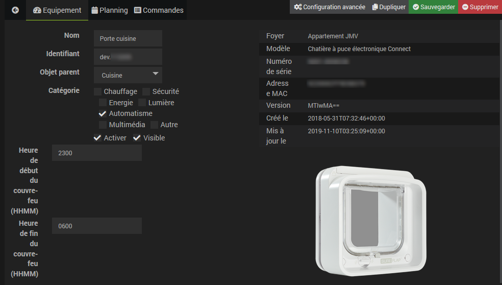

Description
===

Plugin permettant de les objets connectés pour animaux de la marque Sure Petcare (anciennement Sureflap).

Pour le moment les seuls objets connectés sont des chatières
- La grande chatière connect (Pet Porte Connect en anglais)
- La chatière à puce électronique connect (Microchip Cat Flap Connect en anglais)

Note : le plugin ne communique pas directement avec la chatière ou le hub,
il interroge le serveur surepetcare.io qui lui communique avec le hub et à travers lui avec les objets connectés.
A ma connaissance personne n'a pu decoder le protocole utilisé lors des communications chatière <-> hub 
ou hub <-> serveur surepetcare.io ce qui s'explique car ces communications sont sécurisées.

Avant d'activer le plugin il faut que votre compte sur le serveur de surepetcare.io soit créé avec une adresse mail et un mot de passe
et il faut que l'appli IOS ou Android fonctionne.

Configuration du plugin
===

Il faut entrer :

-   **Adresse mail** : L'adresse mail que vous avez donnée lors de la création du compte sur le site surepetcare.io ou dans l'app IOS ou Android

-   **Mot de passe** : Le mot de passe que vous avez choisi lors de la création du compte sur le ssite surepetcare.io.

Et ne pas oublier de cliquer sur **Sauvegarder**.

Création des équipement
===

Ne cliquez pas sur Ajouter car il ne faut pas créer les équipements manuellement. Cliquez sur "Synchronisation" et le plugin retrouvera sur le site surepetcare.io vos hubs, vos objets connecté (chatières, ...) et vos animaux.

Le plugin est prévu pour un ou plusieurs foyers, mais les foyers n'apparaissent pas comme des objets dans le plugin; Par contre pour chaque objet (équipement ou animal) le foyer dont il dépend est indiqué dans les détails.

Lorsqu'on clique sur le bouton "Synchronisation" le plugin récupère tous les équipements et tous les animaux pour tous les foyers du compte.

Si on le désire il est ensuite possible de supprimer certains objets, mais cette opération sera à renouveler à chaque synchronisation. Pour cette raison, il est préférable de ne pas cocher "Visible" pour les objets qu'on ne souhaite pas visualiser.

Les Objets
===
En cliquant sur un équipement, on accède aux détails de cet équipement :

Idem pour un animal mais les informations sont différentes

On peut choisir l'objet parent parmi les objets Jeedom pour contrôler où apparaîtra le widget de cet équipement ou de cet animal sur le dashboard si bien sûr on coche "Visible"
Pour une chatière on peut définir les heures de début et de fin du couvre-feu au format HHMM, par exemple 0630 pour 6 heure 30 minutes.

Les commandes disponibles
===

En cliquant sur l'onglet commande vous accédez aux commandes disponibles.

Ces commandes sont différentes pour un hub, un objet connecté ou un animal.

Changer certains noms de commandes peut provoquer des dysfonctionnements.

Commande pour un hub

| Nom                                  | Type    | Sous type  | Rôle                                                                                                                                                               |
| :--:                                 | :---:   | :---:      | :---:                                                                                                                                                              |
| **Mode led**                         | action  | liste      | Fixe le mode d'allumage des leds ("oreilles") du hub (Eteint, Brillant, Atténué).                                                                                  |
| **Etat led**                         | info    | numeric    | Indique le mode d'allumage des leds ("oreilles") du hub (0=Eteint, 1=Brillant, 4=Atténué).                                                                         |

Commandes pour une chatière

| Nom                                  | Type    | Sous type  | Rôle                                                                                                                                                               |
| :--:                                 | :---:   | :---:      | :---:                                                                                                                                                              |
| **Mode verrouillage**                | action  | Liste      | Fixe le mode de verrouillage de la chatière (Rien, Entrée, Sortie, Tout, Couvre-feu)                                                                               |
| **Activer couvre-feu**               | action  | Défaut     | Active le couvre-feu avec les heures de début et de fin définies dans la configuration de  l'objet                                                                 |
| **Désactiver couvre-feu**            | action  | Défaut     | Désactive le couvre-feu                                                                                                                                            |

Commandes pour un animal

| Nom                                  | Type    | Sous type  | Rôle                                                                                                                                                               |
| :--:                                 | :---:   | :---:      | :---:                                                                                                                                                              |
| **Localisation**                     | info    | numeric    | Indique si l'animal est à l'extérieur ou à l'intérieur (1 = intérieur, 2 = extérieur)                                                                              |

FAQ
===
